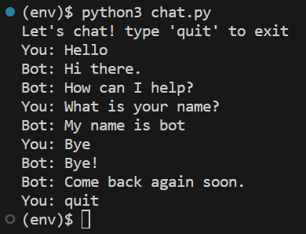

# My Chatbot API

## Project Description
I have a portfolio webiste and also wanted to learn more about NLP and machine learning. So I thought it would be a good idea to create a chatbot for it. I relied on the instructions provided in the videos by <a href="https://twitter.com/patloeber" target="_blank">Patrick Loeber</a> located <a href="https://www.youtube.com/playlist?list=PLqnslRFeH2UrFW4AUgn-eY37qOAWQpJyg" target="_blank">here</a> and <a href="https://www.youtube.com/watch?v=a37BL0stIuM&t=913s" target="_blank">here</a>. I used the data from my portfolio resume site located <a href="https://randr000.github.io/portfolio-resume" target="_blank">here</a> to train my bot.

### Training Data
The patterns and responses for the intents are defined in a json file. By default, the example.intents.json file is used when the INTENTS_ENV environment variabe is set to 'dev' and the intents.json file is used when the INTENTS_ENV environment variable is set to 'prod'. The default file names can be changed in the constants.py file. The model is saved in the example.data.pth or data.pth file if the INTENTS_ENV environment variable is set to 'dev' or 'prod' respectively. I included the intents.json and data.pth file in the .gitignore file in order to keep my training data and model private.

In order to make editing the intents file easier, I created an intents.py file where I store the intents in a python dictionary. This file is also in the .gitignore file but I did create an example.intents.py file so one can see how it should be set up. I then run the python script intents_to_json.py to convert the dictionary into json and save it to the intents.json file by typing the following in the terminal:

<code>$ python3 intents_to_json.py</code>

### Chatbot
The chatbot is trained using a bag-of-words model. It is also stateless which means it will not remember what you previously wrote to determine a response. The bot is also not storing conversations anywhere and is not being trained with the text a user inputs.

### How to Run?
1. Make sure an updated version of Python3 is installed on your system. If not, please install it. You can download it from <a href="https://www.python.org/downloads/" target="_blank">here</a> or install it from the terminal using the correct command for your operating system.
2. Clone the repository to your local drive in a directory/folder you specify.
3. Activate a python virtual environment using the default venv module or your preferred third-party package.
4. Install dependencies:
     <code>$ pip3 install -r requirements.txt</code>
5. Create a file called intents.py. You can create and edit your intents here following the example in the example.intents.py file.
6. Type the following in the terminal and hit enter: <code>$ python3 intents_to_json.py</code> 
This will create the intents.json file. Alternatively, you can create the intents.json file manually by following the example in the example.intents.json file.
7. Create a .env file similar to the sample.env file. Make sure the INTENTS_ENV variable is set to 'prod' so that the intents.json file is used as the training data.
8. To train the data, type the following in the terminal and hit enter: <code>$ python3 train.py</code> 
The model will be saved in the data.pth file as long as the INTENTS_ENV environment variable is set to 'prod'. The example.data.pth file is a pre-trained model that was trained using the data in the example.intents.json file. If you would like to retrain the example.data.pth file, make sure the INTENTS_ENV environment variable is set to 'dev'.
9. To run the chatbot from the terminal, type the following in the terminal and hit enter: <code>$ python3 chat.py</code> 
It will use the model in the data.pth file if the INTENTS_ENV environment variable is set to 'prod'. If it is set to 'dev', then it will used the model saved in the example.data.pth file.

10. You can test the api locally and connect it to your front-end app by typing the following in the terminal: <code>$ python3 app.py</code> 
The api enpoint will be 'http://&lt;localhost or 127.0.0.1&gt;:5000/api/predict'.
If you would like to run with gunicorn, type the following in the terminal and hit enter: <code>bash start_server.sh</code> 
If you run this in a remote server, the api enpoint would be 'http://&lt;remote hostname or ip address&gt;:5000/api/predict'.